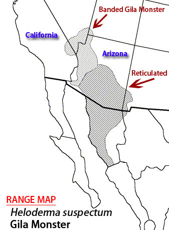

```{r setup, include=FALSE}
#Its common to have a setup area to help keep track of required packages and formatting options

library(tidyverse)  #importing, tidying, plotting data
library(knitr)      #making tables
library(leaflet)
#library(tinytex)   #may need for knitting pdf versions of .rmd file
library(hexbin)

#knitr::opts_chunk$set(fig.width = 5, fig.asp = 1/3) #force figures to be a certain size and aspect ratio
#opts_chunk$set(echo=FALSE)   #can force hide all code in the output; disables 'code folding'
```

This is an example of an [R Markdown](http://rmarkdown.rstudio.com) Notebook.
When you execute code within the notebook, the results appear beneath the code.
This allows you to have a linear workflow, which will help you collaborate with others more efficiently.
The basics of R Markdown can be found [here](https://r4ds.had.co.nz/r-markdown.html).
There is also a cheatsheet in the RStudio help menu.

[First, lets make a simple graph using some base R code.]{style="color:blue"}

```{r Cars Graph}
plot(dist ~ speed, data = cars)
model_1 <- lm(dist ~ speed, data = cars)
abline(model_1)

```

[Next, we can fit a linear model.]{style="color:blue"}

```{r Cars Linear Model}
model_2 <- lm(dist ~ speed, data = cars)
anova(model_2)
```

[Lets remake the graph from the diamonds example, using ggplot2 code.]{style="color:blue"}

```{r Diamond Graph, echo=FALSE, message=FALSE, warning=FALSE}
ggplot(diamonds, aes(carat, price)) +
  geom_hex()

ggsave("outputs/diamonds_md.pdf") #ggplot stores it in outputs folder we created previously
```

*Inline code to use in displaying results.*

We have data about `r nrow(diamonds)` diamonds.
The average price is `r mean(diamonds$price)` dollars.
Diamonds range from `r min(diamonds$price)` to `r max(diamonds$price)` dollars.

[Lets make a table that displays some of the raw diamond data.]{style="color:blue"}

```{r Diamond Table}
#https://rmarkdown.rstudio.com/lesson-7.html
kable(diamonds[1:20, ], caption = 'Table 1. A knitr kable displaying the first 20 diamonds in the data set.')
```

[Lets make a table that summarizes the diamond data.]{style="color:blue"}

```{r Diamond Price Summary}
summary1 <- summarise(group_by(diamonds, cut),
          n=n(), 
          mean=mean(price),
          sd=sd(price))  
kable(summary1, caption = 'Table 2. A summary kable displaying number, mean, and standard deviation for each of five cuts of diamond.', digits = c(0, 0, 1, 1))
```

[Lets insert a static image, like a picture or figure. Notice that this is inline code, not inside a code chunk.]{style="color:blue"}



[Lets make a simple map for our report.]{style="color:blue"}

```{r Map}
leaflet() %>%
  setView(-87.354841, 36.534942, zoom = 16) %>% #lat-long of the place of interest
  addTiles() %>%
  addMarkers(-87.354841, 36.534942, popup = "APSU")
```

[Lets embed something totally ridiculous, but cool...]{style="color:blue"}

<iframe width="610" height="348" src="https://www.youtube.com/embed/8RXYN0DnYeU" data-external="1">

</iframe>
